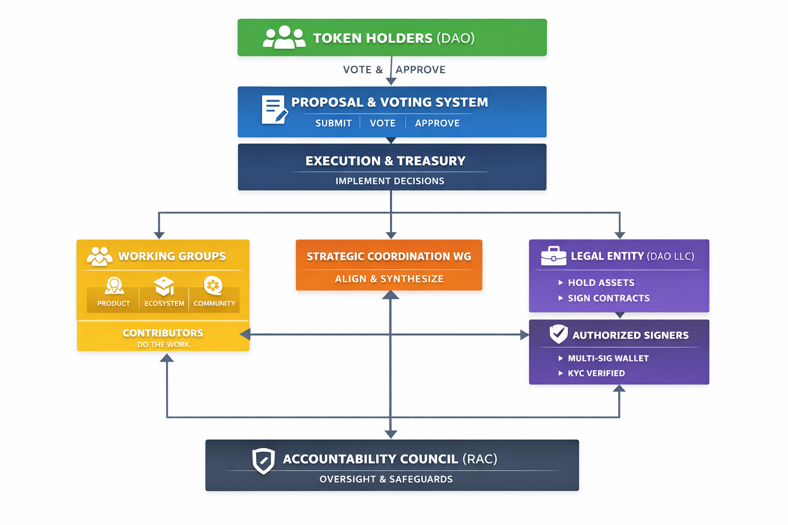

# Radix DAO Governance Structure

The Radix DAO operates using a **layered governance model**, designed to balance decentralization of authority, operational clarity, real-world execution capability, and long-term adaptability.

**This document is the full framework reference.** Not all documents in it are active simultaneously — governance complexity is introduced in deliberate phases. See the Activation Status section below for what is in force right now.

---

## Governance Architecture



*The diagram above illustrates the structural relationships between governance bodies — Token Holders, Proposal & Voting System, Execution & Treasury, Working Groups, Legal Entity, Authorized Signers, and the Accountability Council. It represents the architecture of the system, not its current activation status. For what is in force right now, see the Activation Status section below.*

---

## Governance Layers

### Charter (Principles)

The founding document of the DAO. Defines purpose, governance authority, core principles, treasury stewardship, and structural guarantees.

The Charter is the **highest authority** in the framework. All other documents derive their legitimacy from it and must be consistent with it. Changes to the Charter require a Constitutional proposal with supermajority approval.

---

### Governance Processes

Defines how the DAO operates in practice — how proposals are made and approved, how funds are allocated, how roles are assigned and governed, how disputes and emergencies are handled, and how the governance system itself evolves over time.

These documents are modular: each covers a distinct area of governance, can be updated independently (within governance rules), and connects to others through clearly defined references.

---

### Legal and Representation

Defines how the DAO operates in the real world: legal entity structure, asset custody and control, contractual representation, and the relationship to the Radix Foundation during transition.

---

### Execution Layer

Defines how decisions are carried out: Working Groups coordinate execution, contributors deliver work, and Authorized Signers execute treasury and legal actions. Execution authority is deliberately separated from decision-making authority.

---

## Activation Status

The governance framework is introduced in three tiers. This is intentional — launching full operational complexity from day one would create unnecessary friction during the transition period and deny the community the opportunity to refine policies through real-world use.

### Tier 1 — Fully Active (Phase 1 Launch)

Enforceable from the first day of DAO operations:

| Document | Location |
|---|---|
| Charter | Charter/ |
| Proposal & Voting Framework | Governance-Processes/Core/ |
| Execution & Treasury Actions Policy | Governance-Processes/Core/ |
| Emergency & Safeguards Policy | Governance-Processes/Core/ |
| Treasury Risk & Diversification Policy | Governance-Processes/Core/ |
| Open Source & IP Policy | Governance-Processes/Core/ |
| Code of Conduct | Governance-Processes/Core/ |
| Conflict of Interest Policy | Governance-Processes/Roles/ |
| Token Delegation Policy | Governance-Processes/Core/ |
| Dispute Resolution & Arbitration Policy | Governance-Processes/System-Integrity/ |
| Governance Continuity Framework | Governance-Processes/System-Integrity/ |
| Governance Maintenance & Upgrade Framework | Governance-Processes/System-Integrity/ |
| Election & Role Governance Policy | Governance-Processes/Roles/ |
| Authorized Signers Rules | Governance-Processes/Roles/ |
| Working Group Framework | Governance-Processes/Execution/ |
| Legal Wrapper & Representation | Legal/ |
| RAC Mandate | Legal/ |
| DAO Parameters Registry | Parameters/ |
| All Working Group Charters | Working-Groups/ |
| Transition Governance Framework | Transition/ |

---

### Tier 2 — Guiding Principles (Formal Approval During Year 1)

These policies are published and available. They are expected to be followed in spirit by all Working Groups and contributors from launch. They become **formally enforceable** — including under the dispute resolution and sanctions framework — only after a community governance vote formally approves each one.

The Governance & Legal Working Group is responsible for bringing each policy to a governance vote on schedule.

| Document | Location | Target Approval |
|---|---|---|
| Transparency & Reporting Policy | Governance-Processes/Core/ | Month 2 |
| Contributor Compensation Policy | Governance-Processes/Core/ | Month 3 |
| Grant Program Policy | Governance-Processes/Core/ | Month 3 |
| Security Disclosure & Bug Bounty Policy | Governance-Processes/Core/ | Month 4 |
| Ethics Reporting Policy | Governance-Processes/System-Integrity/ | Month 4 |
| Contributor Onboarding & Offboarding | Governance-Processes/Execution/ | Month 6 |

---

### Tier 3 — Triggered by Need

These activate at the moment they become operationally relevant, regardless of calendar timing:

| Document | Location | Trigger |
|---|---|---|
| Smart Contract Audit Policy | Governance-Processes/Core/ | Before any governance contract deployment is proposed |

---

## Full Document Index

```
Radix-DAO/
│
├── Charter/
│   └── charter.md
│
├── Governance-Processes/
│   │
│   ├── Core/
│   │   ├── Proposal-and-Voting-Framework.md          [Tier 1]
│   │   ├── Execution-and-Treasury-Actions-Policy.md  [Tier 1]
│   │   ├── Emergency-and-Safeguards-Policy.md        [Tier 1]
│   │   ├── Treasury-Risk-and-Diversification-Policy.md [Tier 1]
│   │   ├── OpenSource-and-Intellectual-Property-Policy.md [Tier 1]
│   │   ├── Code-of-Conduct.md                        [Tier 1]
│   │   ├── Token-Delegation-Policy.md                [Tier 1]
│   │   ├── Transparency-and-Reporting-Policy.md      [Tier 2 — month 2]
│   │   ├── Contributor-Compensation-Policy.md        [Tier 2 — month 3]
│   │   ├── Grant-Program-Policy.md                   [Tier 2 — month 3]
│   │   ├── Security-Disclosure-and-Bug-Bounty-Policy.md [Tier 2 — month 4]
│   │   └── Smart-Contract-Audit-Policy.md            [Tier 3 — on first deployment]
│   │
│   ├── System-Integrity/
│   │   ├── Dispute-Resolution-Arbitration-Policy.md  [Tier 1]
│   │   ├── Governance-Continuity.md                  [Tier 1]
│   │   ├── Governance_Maintenance-and-Upgrade.md     [Tier 1]
│   │   └── Ethics-Reporting-Policy.md                [Tier 2 — month 4]
│   │
│   ├── Roles/
│   │   ├── Election-and-Role-Governance-Policy.md    [Tier 1]
│   │   ├── Authorized-Signers-Rules.md               [Tier 1]
│   │   └── Conflict-of-Interest-Policy.md            [Tier 1]
│   │
│   └── Execution/
│       ├── Working-Group-Framework.md                [Tier 1]
│       ├── Working-Group-Charter-Template.md         [Tier 1]
│       └── Contributor-Onboarding-and-Offboarding.md [Tier 2 — month 6]
│
├── Working-Groups/
│   ├── WB-Strategic-Coordination/
│   │   └── Strategic-Coordination-WG-Charter.md
│   ├── WG-Governance-and-Legal/
│   │   └── Governance-and-Legal-WG-Charter.md
│   ├── WG-Product-and-Protocol/
│   │   └── Product-and-Protocol-WG-Charter.md
│   ├── WG-Ecosystem-Growth/
│   │   └── Ecosystem-Growth-WG-Charter.md
│   ├── WG-Community-and-Marketing/
│   │   └── Community-and-Marketing-WG-Charter.md
│   └── Working-Group-IOP-Template.md
│
├── Legal/
│   ├── Legal-Wrapper-and-Representation.md
│   └── RAC-Mandate.md
│
├── Parameters/
│   └── DAO-Parameters-Registry.md
│
├── Transition/
│   ├── Transition-Governance-Framework.md
│   └── Phase1-governance-proposal.md
│
└── Supporting-Materials/
    ├── governance-body-intro.md  ← you are here
    └── RadixGovFramework.png
```

---

## Design Principles

This layered, phased structure ensures:

* **Clear separation of authority** — decision-making and execution are distinct
* **No hidden power concentration** — all authority is defined and bounded
* **Operational flexibility** — the DAO can function effectively from day one without being overwhelmed by process
* **Resilience under failure** — continuity mechanisms exist for governance body failures
* **Ability to evolve** — each document is independently updatable within governance rules

---

## Modularity

Each document in this framework is:

* Focused on a single responsibility
* Independently updatable (within governance rules)
* Connected to others through clearly defined cross-references

This enables safer upgrades, easier community contribution, and better long-term maintainability. The full version history of all documents is tracked in [CHANGELOG.md](../CHANGELOG.md).

---

## Guiding Principle

> The governance system is designed to be:
> simple enough to understand, structured enough to operate, and flexible enough to evolve.
